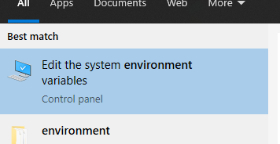
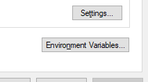

# Java Workshop 01 - Hello World

In this session, we will go through Java setup essentials, and create and run a simple Hello World application.

## Agenda

1. Download & install JDK

   https://adoptopenjdk.net/

2. Setup to run java from the command line
3. Create Hello World app
4. Compile & run
5. Test with different Java versions
6. Download & install IDE

   https://www.jetbrains.com/toolbox-app/

7. Create a new project
8. Create Hello World app
9. Run from IDE
10. Debug from IDE
11. Summary
12. Q&A

## Configure environment variables

To configure environment variables in Windows 10, open up the start menu and search for "envrironment".

In the System Properties dialog, select "Environment Variables...".

Create the variables JAVA_8_HOME and JAVA_11_HOME that point to the downloaded and extracted java packages.
