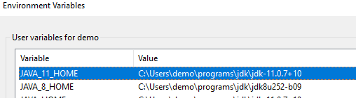

# Java Workshop 01 - Hello World

In this session, we will go through Java setup essentials, and create and run a simple Hello World application.

## Agenda

1. Download & install JDK

   https://adoptopenjdk.net/

2. Setup to run java from the command line
3. Create Hello World app
4. Compile & run
5. Test with different Java versions
6. Download & install IDE

   https://www.jetbrains.com/toolbox-app/

7. Create a new project
8. Create Hello World app
9. Run from IDE
10. Debug from IDE
11. Summary
12. Q&A

## Configure environment variables

To configure environment variables in Windows 10, open up the start menu and search for "envrironment".


In the System Properties dialog, select "Environment Variables...".


Create the variables `JAVA_8_HOME` and `JAVA_11_HOME` that point to the downloaded and extracted java packages.



Create a variable `JAVA_HOME` that points to `JAVA_8_HOME`.


Prepend `%JAVA_HOME%\bin` to the `Path` variable.


Now, every time you open a new command prompt, the JDK you have pointed out in your `JAVA_HOME` variable will be available. To change from Java 8 to Java 11, just change the `JAVA_HOME` variable.

## Compile and run java

To compile a java sourcefile, use the javac command:

```
javac SourceFile.java
```

This will compile the java code into a binary class file.

To execute the compiled java, use the java command and provide the class name:

```
java MyApp
```

Note: with Java 11 and higher, it is possible to execute java code without compiling it first, by invoking the java command and providing the sourcefile:

```
java SourceFile.java
```